# How to install the AEM 6.5 connector

> Originally published 27 April 2020 by Heinrich Muralt. Rebuilt from the original documentation for this repository.

This guide walks you through installing the Supertext Translation Connector into Adobe Experience Manager (AEM) 6.5.

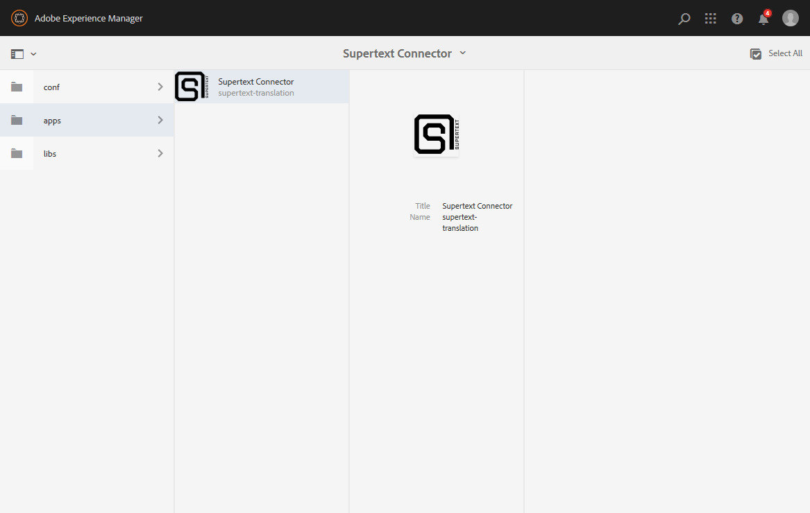

## Packages

The connector ships as two AEM content packages:

- `supertext-connector.ui.content-2.5.zip` — the content package
- `supertext-connector.ui.apps-2.5.zip` — the apps package

Both packages are built from the source in [`../aem-6.5-connector`](../aem-6.5-connector). From that directory run:

```bash
mvn clean install
```

The resulting `.zip` packages are produced under `ui.content/target/` and `ui.apps/target/` respectively. (When available, pre-built packages are also attached to the repository's Releases.)

## Installation

**1. Open the package manager.**

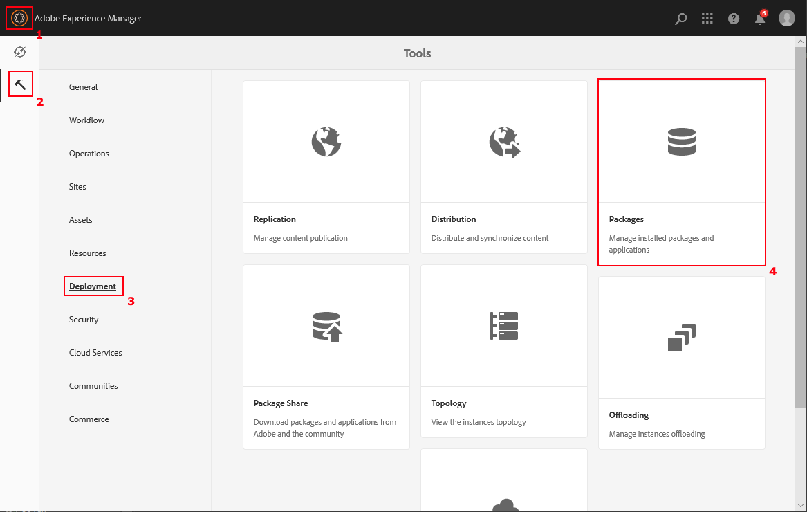

**2. Upload and install the content package (`supertext-connector.ui.content-2.5.zip`).**

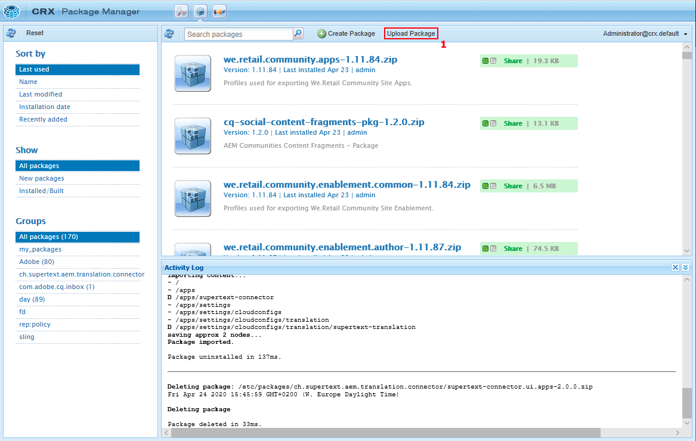

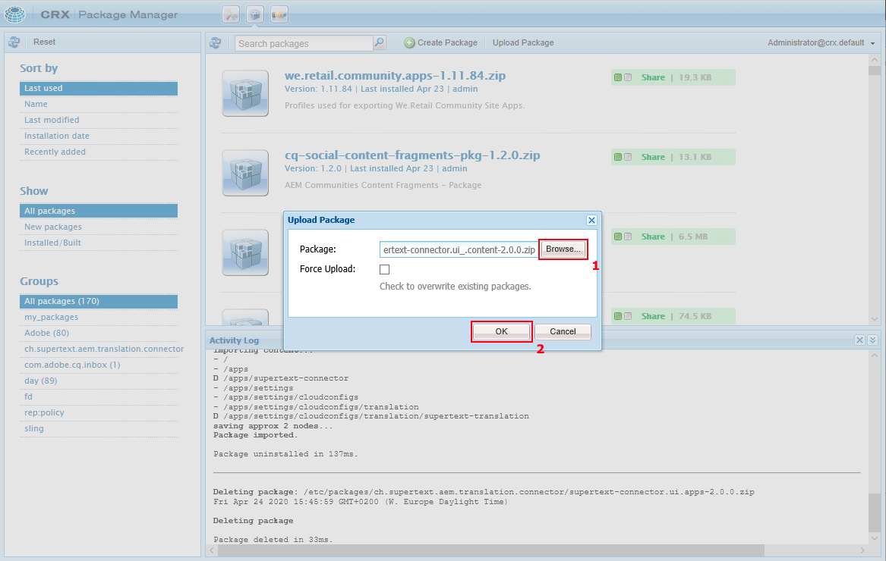

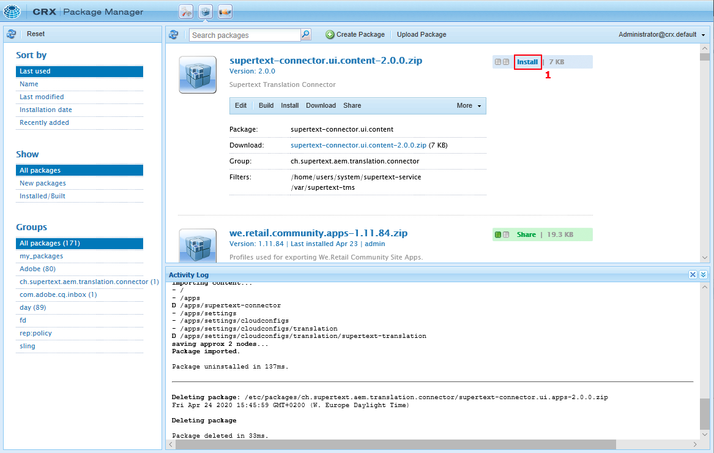

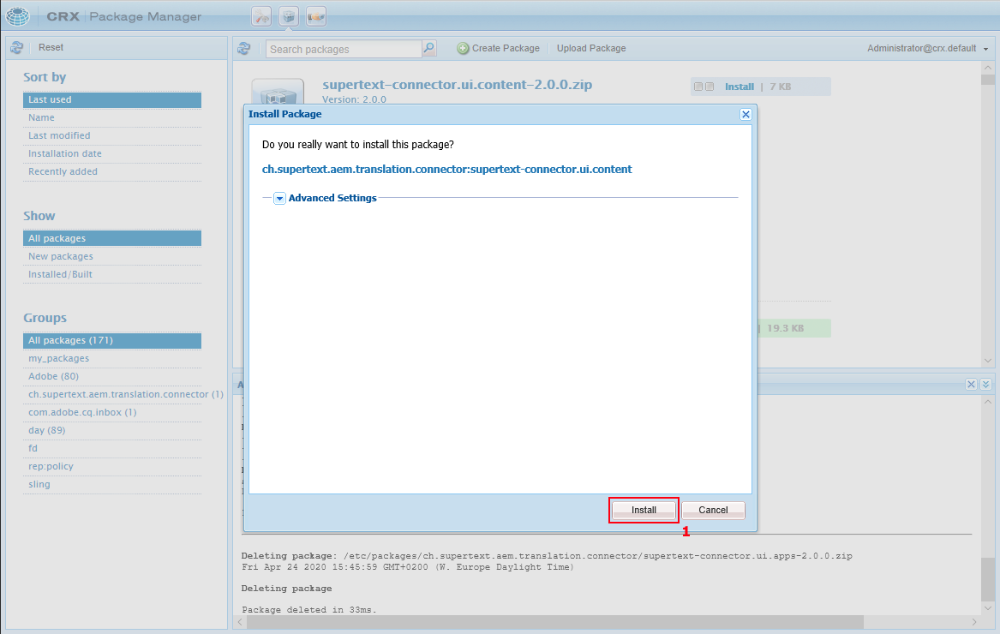

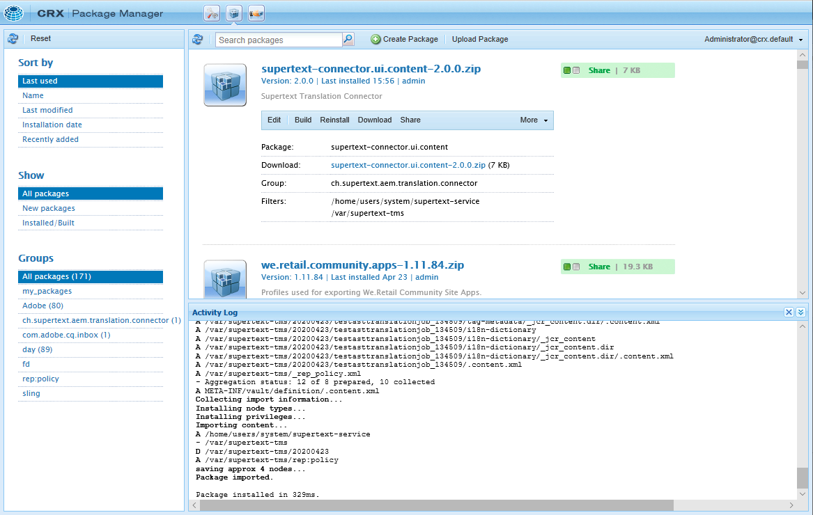

The package is now installed.

**3. Repeat the steps under 2. for the apps package (`supertext-connector.ui.apps-2.5.zip`).**

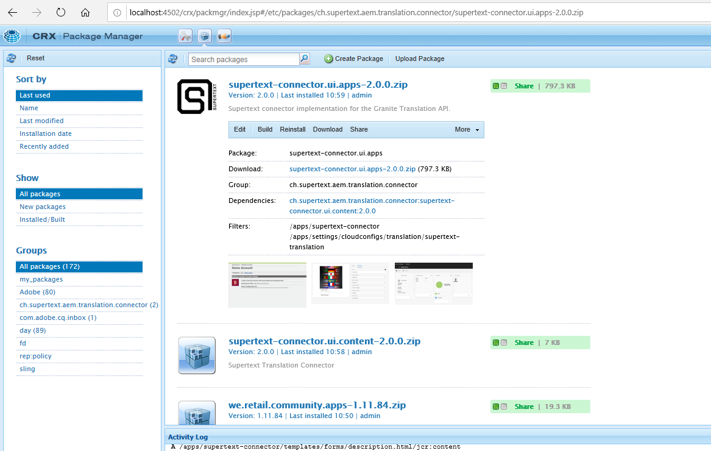

All necessary packages are now installed.

**4. Open Translation Cloud Services.**

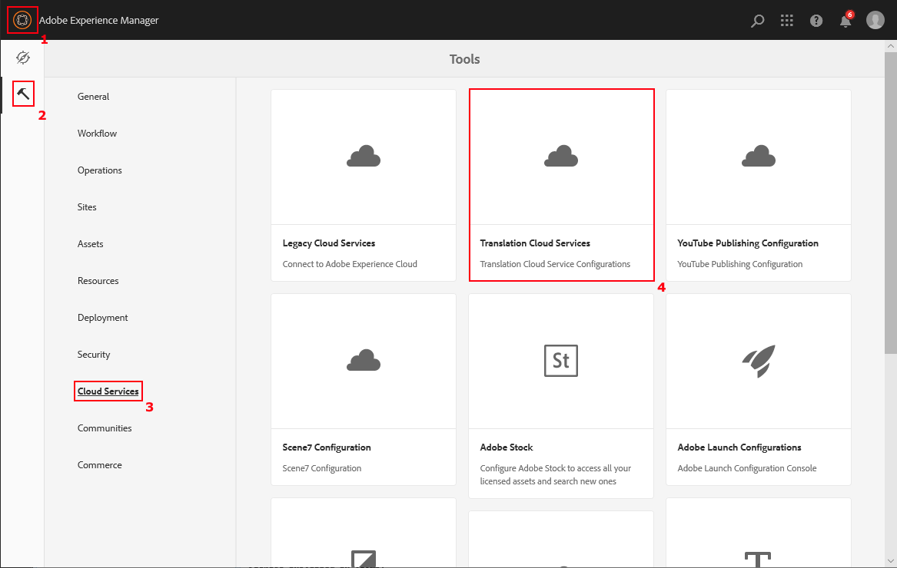

**5. Create a connector configuration.**

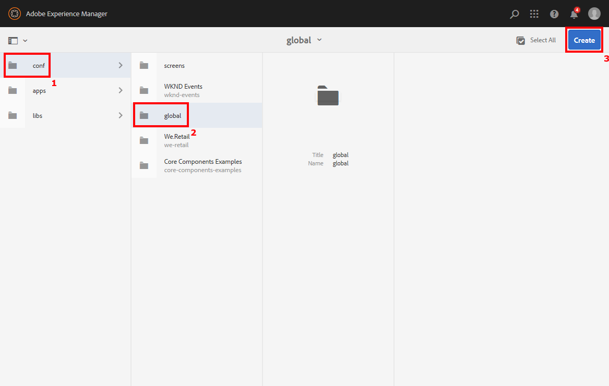

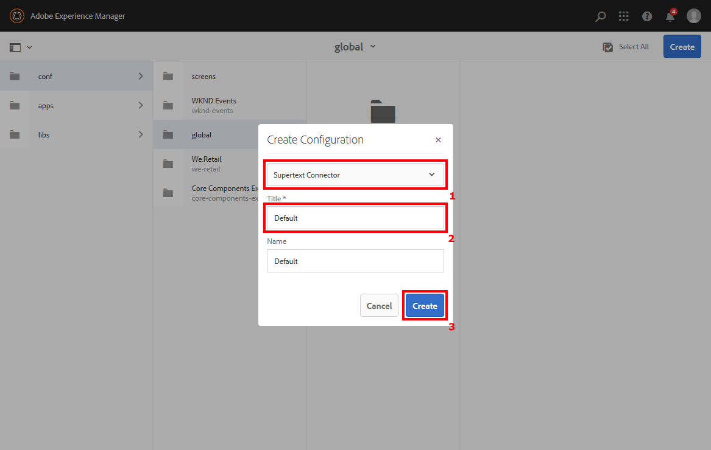

Choosing a title:

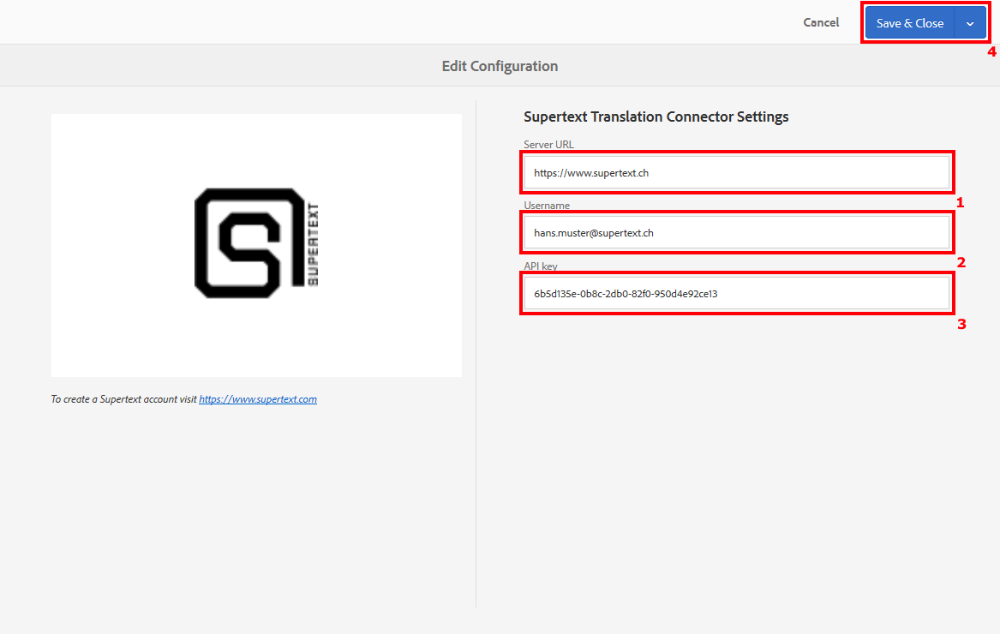

> **2)** You can choose any title. We suggest a descriptive term to differentiate this configuration from others (e.g. *default* for general purpose, *sandbox* for testing purpose, *john doe* for ordering using John Doe's Supertext account). The name is optional.

Endpoint and account settings:

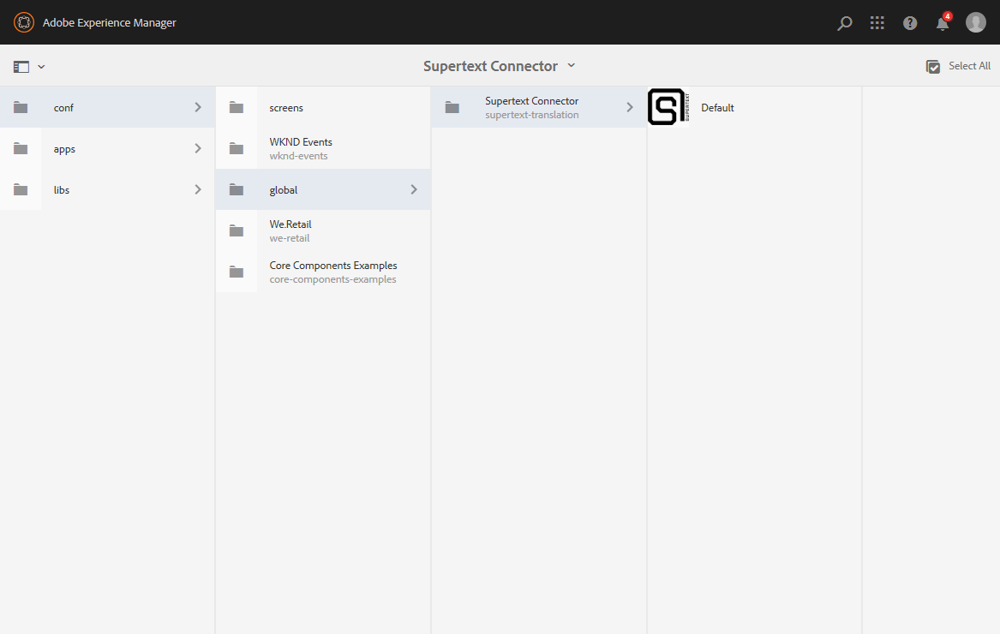

> **1)** Use `www.supertext.com` / `.de` / `.ch` for production, and `staging.supertext.de` / `.ch` for testing.
>
> **2 + 3)** The Supertext account to use for ordering.

All done!

---

See also: [How to use the Supertext connector for AEM 6.5](usage.md)
